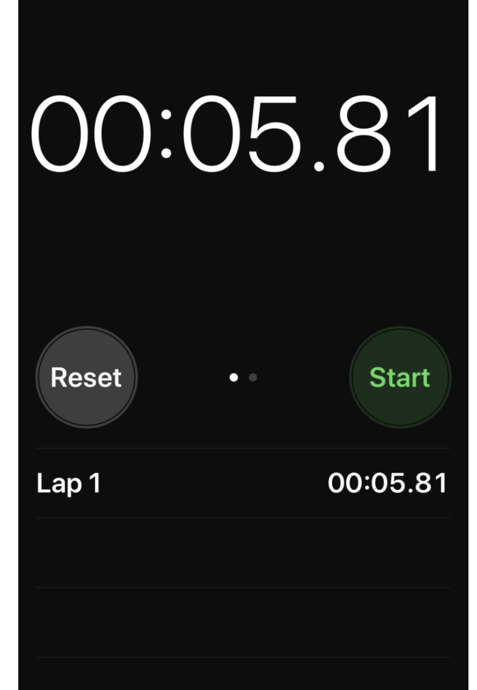

# stop-watch-widget

## Introduction

這個專案需要你打造一個碼錶 APP。可以讓使用者計時、紀錄不同區間的時間。

## Requirements

使用者可以點擊按紐開始計時、重設碼錶、紀錄分段時間。

UI 規則：

- 初始畫面下時間歸零，且有兩個按鈕，分別為 **開始** 和 **分段** ，但此時分段按鈕為 _disabled 狀態_

- 按下開始按鈕，開始計時。小於一小時的時間格式為 _mm:ss_ (eg: 16:28.25)，超過一小時的格式為 _hh:mm:ss_ (eg: 03:03:01.66)，秒數需精準到**小數第二位**

- 開始計時後，兩顆按鈕將變成 **分段** 和 **停止** ：
  當正在計時中，可點擊分段按鈕，將此分段的時間記錄在下方列表中

- 點擊停止按鈕會將時間暫停，且停止按鈕變回開始，若點擊開始，碼表時間將繼續進行
  碼表停止狀態下，分段按鈕將變為 **重設按鈕** ，按下後重設馬錶以及分段記錄列表
- 分段列表是從**新到舊（上到下）**排序，按下分段按鈕後，新分段時間將從 0 開始繼續計時，且不影響主碼表時間，而上一分段的時間紀錄將被推入到列表中顯示

## Reference

參考圖片：

參考影片：
